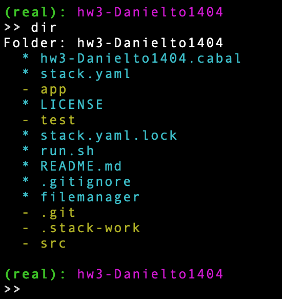

# Haskell: ДЗ 3 -- Используем язык для создания практичного приложения.

### Запуск программы происходит через скрипт ***[run](run.sh)*** ( ***./run.sh*** )
### На входе предлагается выбрать окружение для файловой системы:
* ***virtual*** - Запустит файловый менеджер на **виртуальной** файловой системе с корнем ***~***.
* ***real ROOT_DIRECTORY_PATH*** - запустит файловый менеджер, работающий в **реальной** файловой системе с корнем в ***ROOT_DIRECTORY_PATH***.


### Тонкости реализации:
* Реализована поддержка **../../../**.
* Добавлена функция **pwd** - показывает путь текущей директории.
* Добавлена функция **clear** - очищает окно терминала.
* Файловый менеджер поддерживает следующие функции:
 **exit
   , help
   , dir
   , ls
   , cd
   , info
   , cat
   , touch
   , mkdir
   , rm
   , find
   , write**

### Интерфейс:



## Source code:
* [Main](app/Main.hs)
* [FSActions type class](src/FileSystem/FSActions.hs)  
<!-- * [Third block](src/ThirdBlock)   -->

<!-- ## Tests:
* [First block](test/FirstBlock)
* [Second block](test/SecondBlock)  
* [Third block](test/ThirdBlock)   -->

Третье домашнее задание проверяет понимание основных языка, что используются в
производственном программированиии. Обратите внимание, что задание соответствует
материалу, который рассказан в темах с 5 по 7
[отсюда](https://github.com/jagajaga/FP-Course-ITMO).

К заданию требуется создать тесты.

Документация в формате [Haddock](https://www.haskell.org/haddock/) будет
являться значимым бонусом.

Если вы видите неоднозначность в формулировке домашнего задания, то, пожалуйста,
обратитесь к преподавателям по электронной почте или в официальном канале в
slack.

Задача оценивается в максимум 10 баллов + бонусы.

# Срок сдачи

00:00 (UTC+3) 14 декабря 2020.

## Файловый менеджер

Необходимо реализовать программу для манипуляции файлами на языке Haskell
используя конструкции монадных трансформеров и используя возможности IO монады.
Любые техники, что выходят за рамки текущего курса, будут приветствоваться.

Файловый менеджер имеет простой функционал
просмотра/создания/удаления файлов и папок.

Важно работать с файловой системой в чистом виде. Начните реализацию с
формализации типа описания файловой системы и ее компонентов, а так же типов
для команд. После завершения программы, результаты ее действия должны
существовать в вашей файловой системе и директориях, которыми вы манипулировали.

В тестах требуется воспользоваться "чистотой" функций для работы с файловой системой
и вместо реальной фаловой системы, доступ к которой осуществляется через IO, использовать
чистое представление "игрушечной" файловой системы, одинаковой для каждого запуска.

Обратите внимание на обработку ошибок.

Запрещено пользоваться встроенным в ОС переключением директорий (`setCurrentDirectory`).

P.S. Не требуется считывать всю файловую системы в оперативную память. Считывайте файлы
и папки только когда пользователь потребует от вас этого посредством командной строки.
Аналогично с командой записи в файл. Вы пишите самый обыкновенный файловый менеджер, просто
покрытый тестами :).
P.P.S. Используйтесь классами типов для абстракции функционала, используйте один стек монад
в реализации и другой в тестах.

Для работы с реальной файловой системой используйте библиотеку
[directory](https://hackage.haskell.org/package/directory-1.3.6.1),
для парсинга аргументов командной строки мы рекомендуем
[optparse-applicative](https://hackage.haskell.org/package/optparse-applicative).

Необходимый функционал:

* command line interface (возможна реализация в виде интерактивной коммандной строки);
* переходить по директориям;
* показывать содержимое текущей директории;
* создать папку/файл;
* отобразить содержимое файла;
* удалить папку/файл;
* записать в файл текстовую информацию;
* поиск файла по названию  в текущей директории и ее подчастях и вывод пути до файла;
* отображать информацию о заданном файле:
    * путь;
    * права доступа;
    * тип файла;
    * время создания и/или изменения;
    * размер;    
* отображать информацию о директории:
    * размер;
    * путь;
    * количество файлов внутри;
    * права доступа;


Пример:

```bash
$ my-best-file-manager ~/
/users/my_user/ > help
cd <folder> -- перейти в директорию
dir -- показать содержимое текущей директории
ls <folder> -- показать содержимое выбранной директории
create-folder "folder-name" -- создать директорию в текущей
cat <file> -- показать содержимое файла
create-file "file-name" -- создать пустой файл в текущей директории
remove <folder | file> -- удалить выборанную директорию или файл
write-file <file> "text" -- записать текст в файл
find-file "file-name" --  поиск файла в текущией директории и поддиректориях
information <file> -- показать информацию о файле
information <folder> -- показать информацию о директории
help --  показать руководство по использованию
exit -- завершение работы программы


/users/my_user/ > cd folder-that-exist
/users/my_user/folder-that-exist > dir
a
b
c
/users/my_user/folder-that-exist > ls a
a is not a folder
/users/my_user/folder-that-exist > cat a
aaaaaa
/users/my_user/folder-that-exist > cd no-folder
no-folder does not exist
/users/my_user/folder-that-exist > create-file d
/users/my_user/folder-that-exist > dir
a
b
c
d
/users/my_user/folder-that-exist > exit
```

### Бонусы


Выдаём доп. баллы за:

* Дополнительные команды (при условии что они предлагают интересную семантику, `help` на русском языке не является доп. командой)
* Интерфейс для данной программы (TUI или GUI) (много бонусов)
* Реализацию property тестов со случайной генерацией файловых систем
* За поддержку выхода за пределы директории запуска `cd ../../../`. Если уперлись в root -- выкидывайте ошибку что `..` не существует.
